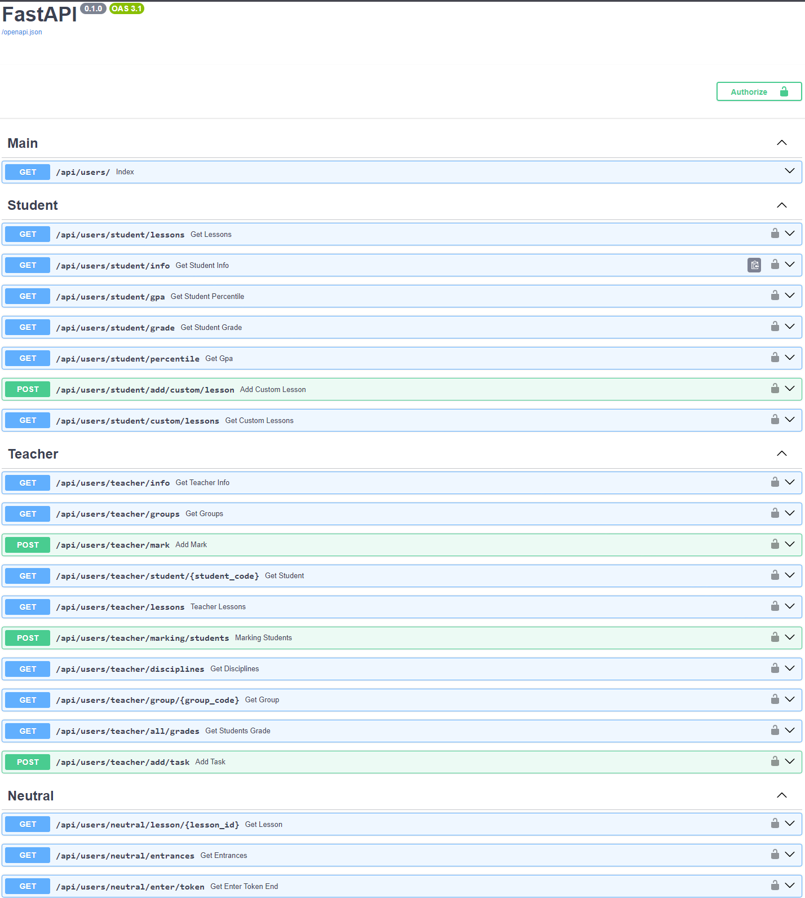
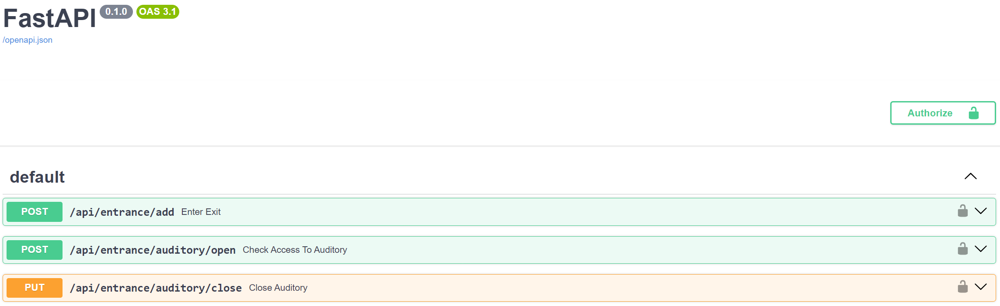
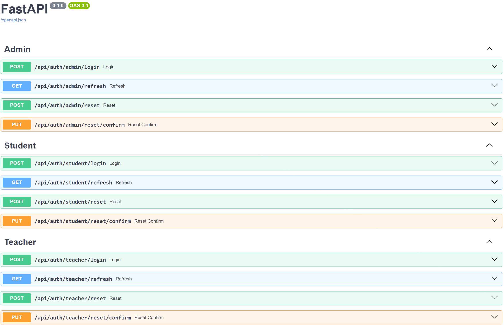

# Это работа проделанная мною в рамках студенческого Хакатона

- [Микросервис для пользователей (преподавателей/студентов)](https://github.com/Zakharov-Ilya-Proger/My-Love/tree/usersMicroservice)
## Описание
В рамках данного микросервиса пользователи такие как студенты могут получать свои оценки, просматривать расписание, просматривать свои оценки и рейтинг  

---------------------------------------------------------

- [Микросервис для контроля входов/выходов](https://github.com/Zakharov-Ilya-Proger/My-Love/tree/entranceMicroservice)
## Описание
В рамках данного микросервиса пользователи всех видов: студенты, преподаватели, работники администрации и staff (уборщики, ремонтники и прочие)  

---------------------------------------------------------

- [Микросервис логина пользователей, ресета пароля и получения нового access токена по refresh](https://github.com/Zakharov-Ilya-Proger/My-Love/tree/loginMicroservice)
## Описание
В рамках данного микросервиса все пользователи, которые имеют доступ к приложению и сайту, такие как студенты, учителя и администраторы могут получить свой access token и refresh token  

